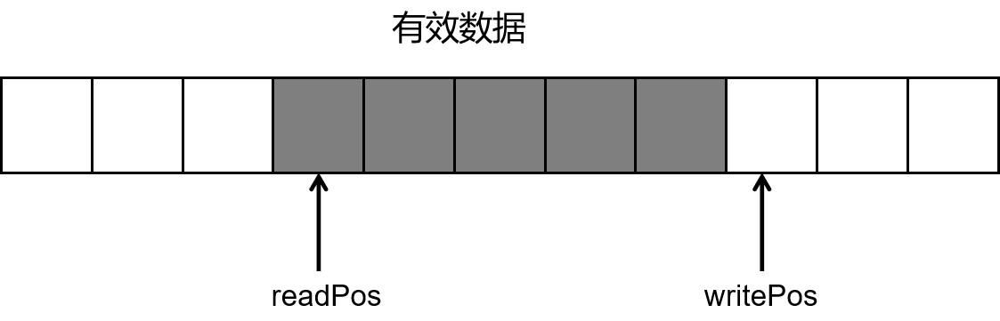

## 可扩展的循环缓冲区

设计一个方便接收和发送字节数据的缓冲区, 避免直接使用C语言风格的字符数组

### 基本功能

- 缓冲区底层使用vector\<char>容器实现，方便后续扩容
- 从缓冲区中读取数据后增加readPos,将数据拷贝(写入)到缓冲区时增加writePos
- buffer必须保证readPos <= writePos, 当写入数据到缓冲区时，若writePos到buffer无足够的空间 则分两种情况讨论
  - 总空闲空间不足 -> 扩容
  - 总空闲空间充足, 将有效数据移动到缓冲区起始位置